<div align="center">

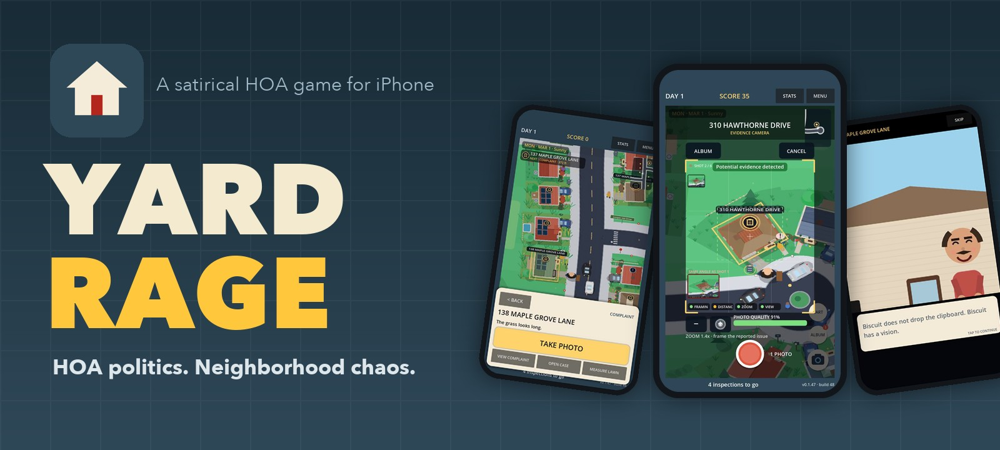

<br>

[](https://github.com/ssnanda/YardRage/releases/latest)
[](#install-with-altstore)
[](#add-the-yard-rage-source-and-install)
[](https://yardrage.com)

**[⬇️ Download the IPA](https://github.com/ssnanda/YardRage/releases/latest/download/yardrage.ipa)** &nbsp;·&nbsp; **[🧭 Install guide](#install-with-altstore)** &nbsp;·&nbsp; **[🌐 yardrage.com](https://yardrage.com)**

</div>

---

Yard Rage is a satirical HOA game from ITSpector LLC. Patrol the neighborhood, investigate complaints, photograph evidence, manage residents, survive board politics, and try to keep your seat.

<p align="center">
  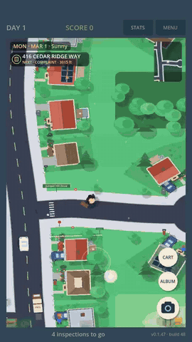
</p>

## The loop

<p align="center"><b>Complaint</b> → <b>Travel</b> → <b>Investigate</b> → <b>Photograph</b> → <b>Decide</b> → <b>Consequence</b> → <b>Follow-up</b></p>

<p align="center">
  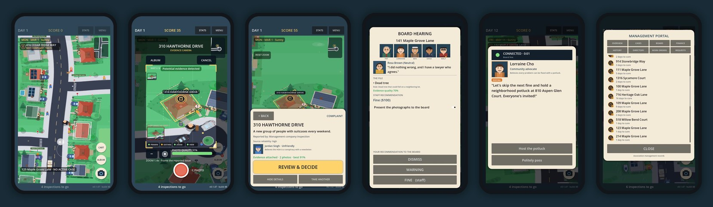
</p>

## What you'll do

| | |
|---|---|
| 🚙 **Patrol** | Walk or ride the golf cart through streets, cul-de-sacs and landmarks. Pinch to zoom. |
| 📸 **Gather evidence** | The camera scores framing, distance, zoom, lighting and trees in the way. Complaints are not proof. |
| ⚖️ **Rule** | Dismiss, warn, schedule a hearing or fine. Fines need a prior notice and usable evidence. |
| 🔁 **Follow up** | Warnings have cure periods. Walk back for reinspection: fixed, partly fixed, unchanged or worse. |
| 🏛️ **Play politics** | Five board members with their own priorities vote. Selective enforcement and legal risk can end your term. |
| 🎬 **Meet your neighbors** | Cinematic front-door encounters, board phone calls, petitions and architectural reviews. |
| 🍂 **Live through the seasons** | Tulips, sprinklers, leaf blowers, snow and holiday lights. Weather changes the sky, crowds and photo quality. |
| 🏘️ **Climb the career ladder** | Survive three annual meetings to complete a term, then unlock the next of six communities. |

<details>
<summary><b>More screenshots</b></summary>
<br>
<p align="center">
  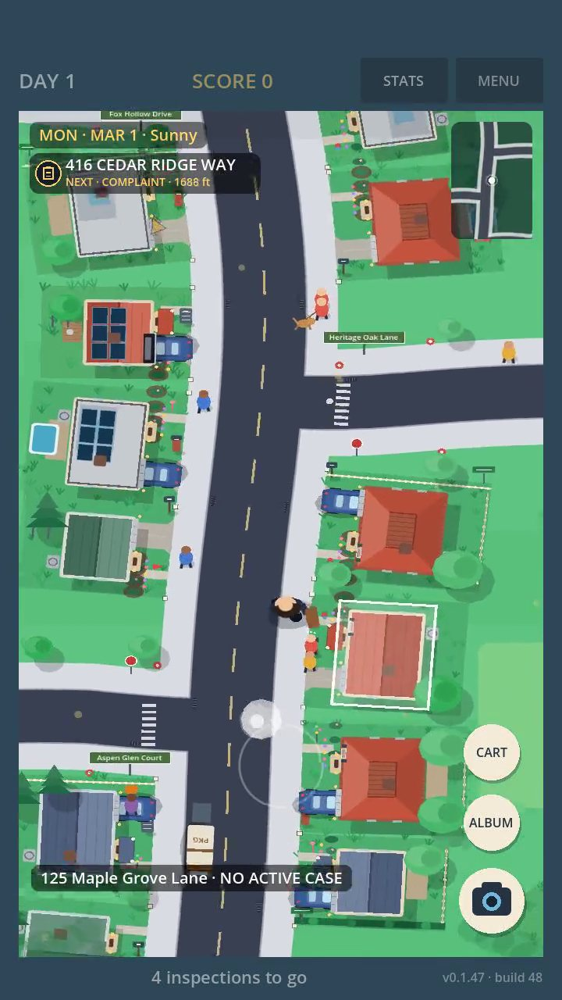
  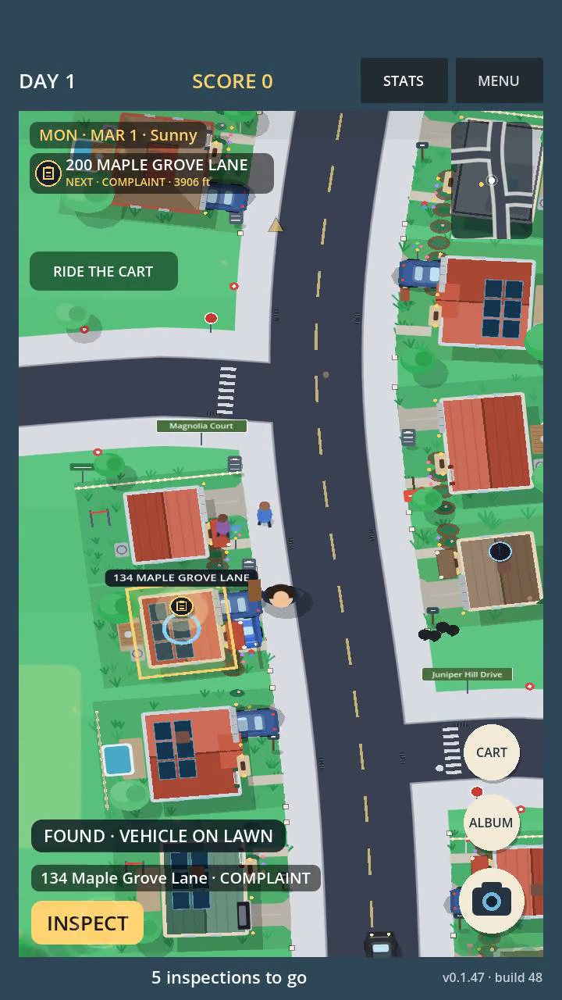
  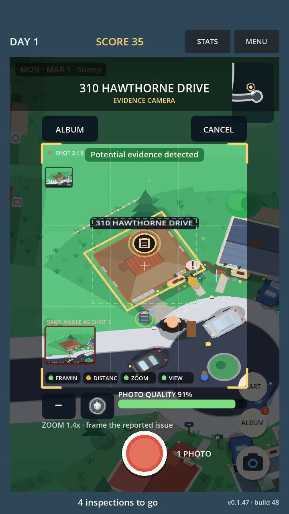
  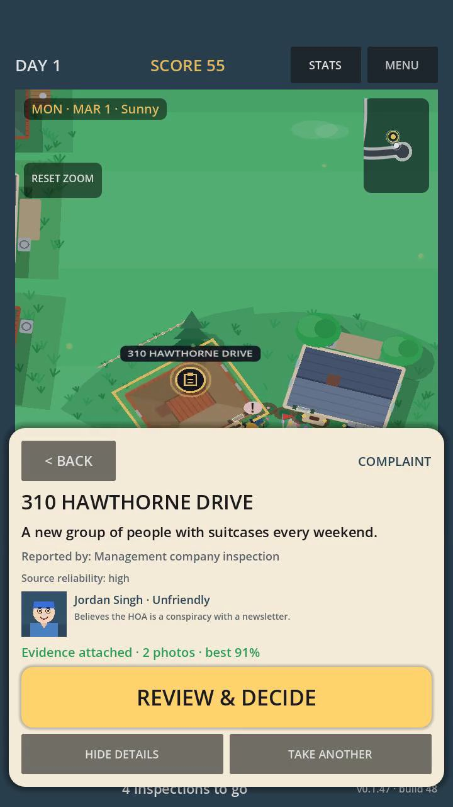
  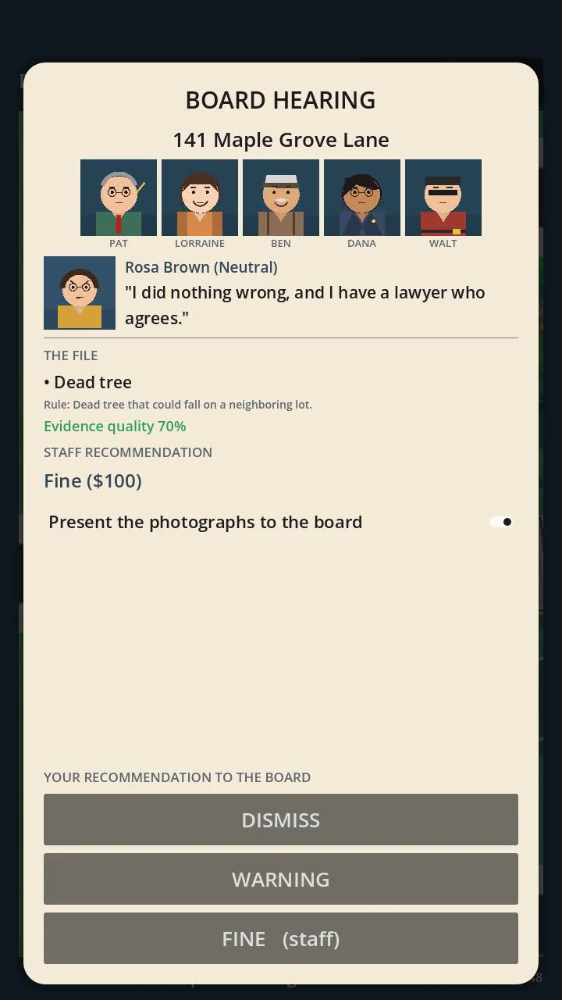
</p>
<p align="center">
  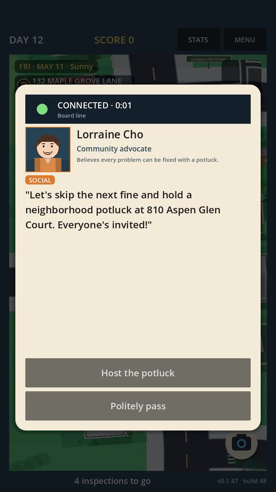
  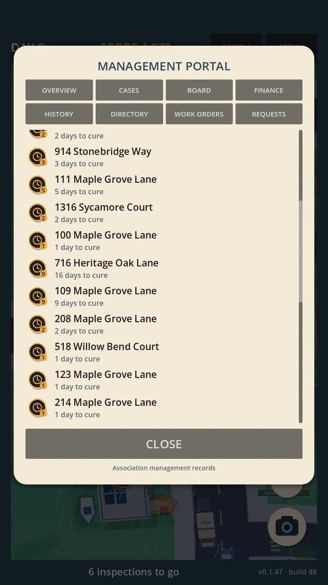
  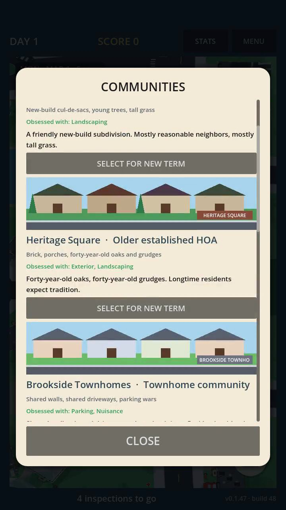
  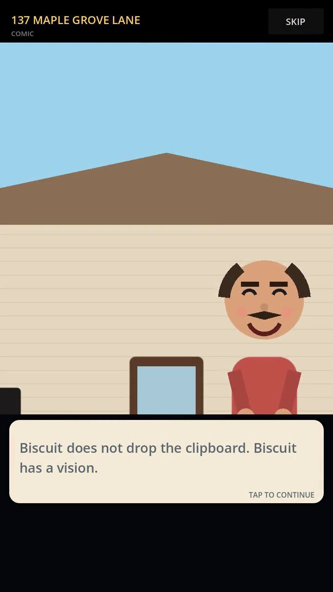
  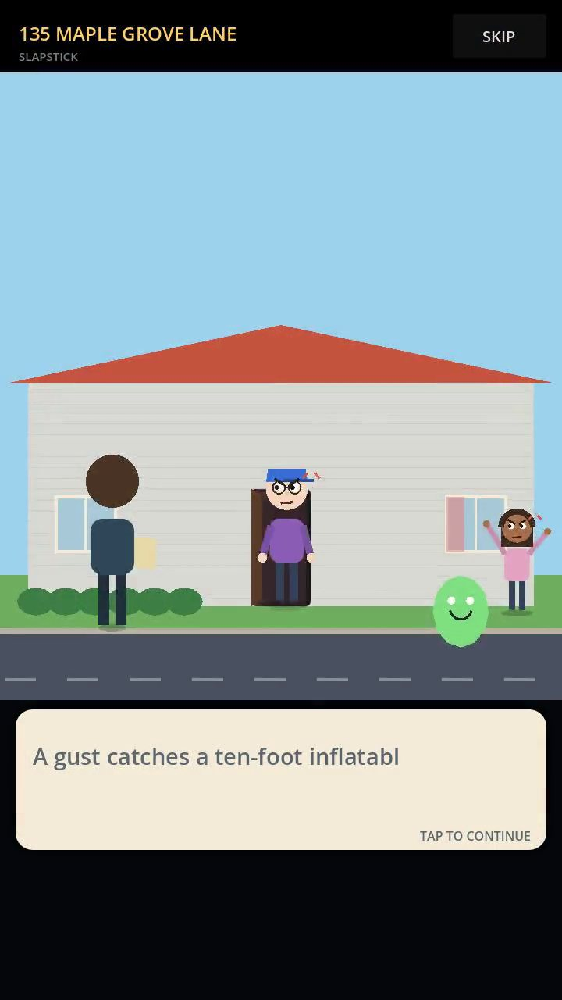
</p>
</details>

## Quick install

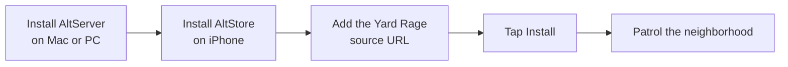

Source URL to paste into AltStore:

```text
https://raw.githubusercontent.com/ssnanda/YardRage/main/altstore.json
```

Requires iOS 13 or later. Full steps below.

## Install with AltStore

Yard Rage requires iOS 13 or later. Xcode is not required. You need a Mac or Windows PC, an Apple ID, a USB cable for initial setup, and AltStore Classic.

<details>
<summary><b>🍎 macOS: install AltServer and AltStore</b></summary>

1. Download [AltServer for macOS](https://altstore.io/) and copy it to **Applications**.
2. Launch AltServer. Its icon will appear in the macOS menu bar.
3. Connect your unlocked iPhone to the Mac with USB and tap **Trust** on both devices if prompted.
4. In Finder, select the iPhone and enable **Show this iPhone when on Wi-Fi**, then apply the change.
5. From the AltServer menu, choose **Install AltStore**, select the iPhone, and enter the Apple ID AltServer should use for signing.
6. On the iPhone, approve the developer profile under **Settings → General → VPN & Device Management** if prompted.
7. On iOS 16 or later, enable **Settings → Privacy & Security → Developer Mode** and follow the restart prompt.

See AltStore’s official [macOS installation guide](https://faq.altstore.io/altstore-classic/how-to-install-altstore-macos) for current screenshots and troubleshooting.

</details>

<details>
<summary><b>🪟 Windows: install AltServer and AltStore</b></summary>

1. Install Apple’s desktop versions of [iTunes](https://www.apple.com/itunes/) and [iCloud for Windows](https://support.apple.com/en-us/103232). AltStore recommends the direct Apple installers rather than the Microsoft Store versions.
2. Download [AltServer for Windows](https://altstore.io/), extract the installer, run `Setup.exe`, and launch AltServer as administrator.
3. Connect your unlocked iPhone to the PC with USB and tap **Trust** on both devices if prompted.
4. Open iTunes, select the iPhone, enable **Sync with this iPhone over Wi-Fi**, and apply the change.
5. From the AltServer taskbar icon, choose **Install AltStore**, select the iPhone, and enter the Apple ID AltServer should use for signing.
6. On the iPhone, approve the developer profile under **Settings → General → VPN & Device Management** if prompted.
7. On iOS 16 or later, enable **Settings → Privacy & Security → Developer Mode** and follow the restart prompt.

See AltStore’s official [Windows installation guide](https://faq.altstore.io/altstore-classic/how-to-install-altstore-windows) for current screenshots and troubleshooting.

</details>

### Add the Yard Rage source and install

1. Open AltStore on the iPhone.
2. Open **Sources**, tap **+**, and add this URL:

   ```text
   https://raw.githubusercontent.com/ssnanda/YardRage/main/altstore.json
   ```

3. Open the Yard Rage listing and tap **Install**.
4. Keep AltServer running and the computer and iPhone on the same network when AltStore needs to install or refresh the app.

### Install the IPA manually

1. Download `yardrage.ipa` from the [latest Yard Rage release](https://github.com/ssnanda/YardRage/releases/latest).
2. Open AltStore and select **My Apps**.
3. Tap **+** and select the downloaded `yardrage.ipa`.
4. Keep AltServer available while AltStore signs and installs the app.

## Releases

Each GitHub release contains an immutable, versioned Yard Rage IPA. Release downloads and the AltStore source are public; the game source code is not included.

---

<p align="center">
  <sub>Developed by <b>ITSpector LLC</b> in North Carolina, USA · <a href="https://yardrage.com">yardrage.com</a></sub>
</p>
